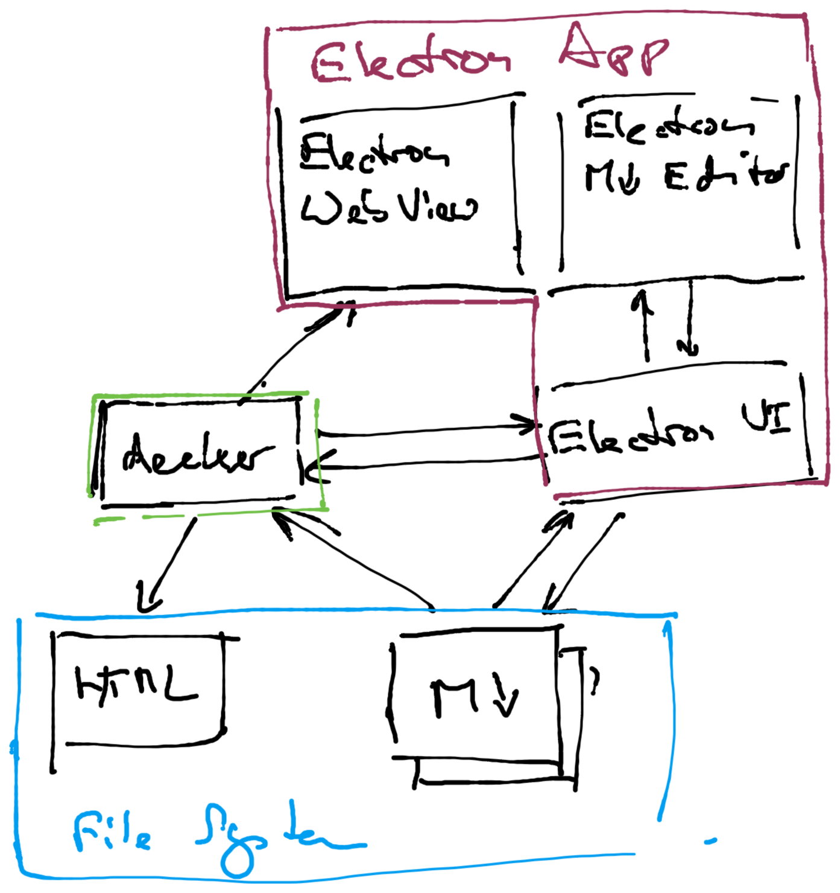

# Executive summary

{width="75%"}

## Decker executable

-   The `decker gui-server` command starts a websocket server
-   A GUI process can remote-control all relevant aspects of decker
    operation via the websocket connection
-   The communication protocol is bi-directional and YAML based

## Common GUI Functions

-   All GUI solutions use the standard decker executable
-   Starts the decker executable and controls it via a Websocket
    connection
-   Starts and controls one decker instance per project
-   Manages multiple decker projects
-   Provides a text editor component that is useful for Markdown editing
-   Shows a direct preview of compiled slide sets, handouts and pages
-   Has direct file system access to the decker project files
-   Can install external tools like Latex, Graphviz or decktape
-   Imports images and movies into a decker project (drag and drop and
    stuff)
-   Has GIT support

## Visual Studio Code Plugin

-   Nice editor support for Markdown
-   Tightly integrated with GIT
-   Plugins can do everything
-   Runs locally and offline
-   Written in TypeScript
-   Implementation cost: low

## Web App

-   HTML, Javascript, CSS
-   Client written in anything that compiles to Javascript
-   Server written in anything
-   Server starts and controls one decker instance per project
-   Cross platform
-   Runs remotely and needs Internet
-   Implementation cost: high

## Electron App

-   HTML, Javascript, CSS
-   Cross platform
-   Runs locally and offline
-   Written in anything that compiles to Javascript
-   Implementation cost: high

## Qt App

-   Native
-   Cross platform
-   Runs locally and offline
-   Written in C++
-   Implementation cost: high

## Mac App

-   100% native GUI
-   Mac only
-   Runs locally and offline
-   Written in Swift
-   Implementation cost: high

## Windows App

-   100% native GUI
-   Mac only
-   Runs locally and offline
-   Written in C\# or C++
-   Implementation cost: high
