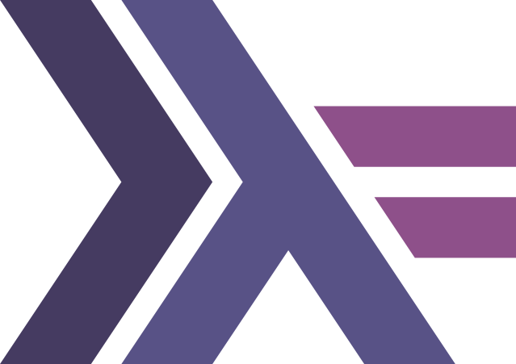

# About Decker

The Decker Slide Tool assists you in creating media-rich presentations with a few easy to use Markdown commands. This example presentation showcases some of the great features of Decker.

We recommend that you open this markdown file in your preferred development editor and read along with the displayed slides. For beginners and those looking for a more detailed explanation, we recommend that you try the Decker Tutorial.

# Navigation

Navigate this presentation with the controls in the bottom-right corner, your arrow keys or the space bar.

The <i class="fas fa-bars"></i> icon in the bottom-left corner opens a menu listing all slides.

- The <i class="fas fa-search"></i> icon opens a search field in the upper right corner.
- The <i class="fas fa-print"></i> icon allows you to print the presentation.
- The <i class="fas fa-times"></i> icon closes the menu.

# Slide Headers

## Heading 2 (h2) {.example}

### Heading 3 (h3) {.example}

#### Heading 4 (h4) {.example}

##

```{.markdown}
# Heading 1 (h1) *new slide created
## Heading 2 (h2)
### Heading 3 (h3)
#### Heading 4 (h4)
```

# Text Emphasis

## {.split}

## {.example}

**This is bold text**\
**This is bold text**\
_This is italic text_\
_This is italic text_\
~~Strikethrough~~\
<u>underline</u>\
H~2~O is a liquid.\
2^3^ equals 8.

##

```{.markdown}
**This is bold text**
__This is bold text__
*This is italic text*
_This is italic text_
~~Strikethrough~~
<u>underline</u>
~subscript~
^superscript^
```

# Text Size {.columns}

## {.left}

## {.xx-small}

xx-small Text

## {.x-small}

x-small Text

## {.small}

small Text

## {.medium}

medium Text

## {.large}

large Text

## {.x-large}

x-large Text

## {.xx-large}

xx-large Text

## {.right .x-small}

```{.markdown}
## {.xx-small}

xx-small Text

## {.x-small}

x-small Text

## {.small}

small Text

## {.medium}

medium Text
```

# Highlight Text

## {.small .example}

This splendid palace of the Prince-Bishops is one of the finest secular Baroque buildings in Germany. Built between <mark>1720 and 1744</mark>, one of the most notable features of this UNESCO World Heritage Site is its spectacular monumental staircase hall with its huge fresco by Tiepolo. All told, some <mark>40 rooms are open to visitors, including the White Hall, with its Rococo stucco work, the sumptuously decorated Imperial Hall, the Hall of Mirrors, and the beautiful Court Church</mark>. Although heavily damaged in WWII, much of the building has now been restored to its former glory, a process that took over 42 years to complete.

## {.small}

```{.markdown}
Built between <mark>1720 and 1744</mark>
```

# Emojis

Decker supports the use of emojis in your presentation.

## Faces

😣 😫 😓 😕 😲 ☹️ 😱 😳 🥺 😎 🤠 🤓 🧐 🥳 😍 😘
😗 😙 😚 ☺️ 🤑 🤪 😤 😠 👿 💀 ☠️ 🤬 😐 😑 😶 🙄
😏 🤐 😒 😬 🤥 🤨 😪 😴 😌 🤤 😔

## Happy Faces

😁 😂 🤣 😃 😄 😅 😆 😉 😊 🙂 😀 🙃 😇 🤩 🥰 😋 😛 😜 😝

## Unhappy Faces

🙁 😖 😞 😟 😢 😭 😦 😧 😨 😩 😰 😥 😮 😯 😵 😷
🤒 🤕 🤢 🤧 🤯 🤮 🥵 🥶 🥴

## Others

👁️‍🗨️ 💋 💘 ❤️ 💓 💔 💕 💖 💗 💙 💚 💛 💜 🖤 💝
💞 💟 ❣️ 💌 💤 💢 💣 💥 💦 💨 💫 💬 🗨️ 🗯️ 💭
🕳️ 💯 🧡 🤡 👹 👺 👻 👽 👾 🤖

# Vertical Slides

Use the `{.sub}` tag to add a slide below. Use the `↓` key or press the spacebar to navigate downward.

## {.small}

```{.markdown}
# Würzburger Residenz {.sub}

In contrast to the Münchner Residenz, which grew over half of a
millennium and therefore contains stylistically diverse epochs,
the Würzburg Residenz was built from scratch in just under a
generation with brief interruptions.
```

# Würzburger Residenz {.sub data-menu-title="Example"}

In contrast to the Münchner Residenz, which grew over half a millennium and therefore contains stylistically diverse epochs, the Würzburg Residenz was built from scratch in just under a generation with brief interruptions.

# Multicolumn Slides {.columns}

## Würzburger Residenz {.top}

Known for its extravagant artistic design and Baroque architecture

## Alte Mainbrücke {.left}

## Festung Marienberg {.center}

## Marienkapelle {.right}

## Dom St. Kilian {.bottom}

Notable for its beautifully restored interior

# Syntax {.sub}

Use the `{.columns}` tag to create columns. Identify each block with a location tag.

## {.x-small}

```{.markdown}
# Multicolumn Slides {.columns}

## Würzburger Residenz {.top}

Known for its extravagant artistic design and Baroque architecture

## Alte Mainbrücke {.left}

## Festung Marienberg {.center}

## Marienkapelle {.right}

## Dom St. Kilian {.bottom}

Notable for its beautifully restored interior
```

# Column Widths

## this left column has a width of 60% {.column width="60%" .example}

## this right column has a width of 25% {.column width="25%" .example}

## {.small}

```{.markdown}
## this left column has a width of 60% {.column width=60%}

## this right column has a width of 25% {.column width=25%}
```

# Grid Layout {.grid}

## One {.top-left}

## Two {.top}

## Three {.top-right}

## Four {.left}

## Five {.center}

## Six {.right}

## Seven {.bottom-left}

## Eight {.bottom}

## Nine {.bottom-right}

# Syntax {.sub .columns}

## {.top}

Use the `{.grid}` tag to partition the slide into a grid. Identify each block with a location tag.

## {.small .left}

```{.markdown}
# Pick a Number {.grid}

## One {.top-left}

## Two {.top}

## Three {.top-right}

## Four {.left}
```

## {.small .right}

```{.markdown}
## Five {.center}

## Six {.right}

## Seven {.bottom-left}

## Eight {.bottom}

## Nine {.bottom-right}
```

# Highlight Blocks

## Alert Block {.alert .split}

- Alert Text

## Question Block {.question}

- Question text

## Observation Block {.observation}

- Observation text

## Example Block {.example}

- Example text

## Answer Block {.answer}

- Answer text

## Definition Block {.definition}

- Definition text

## Equation Block {.equation}

- Equation text

## Note Block {.note}

- Note text

# Syntax {.columns .sub}

## {.small .left}

```{.markdown}
## Alert Block {.alert}

-   Alert Text

## Question Block {.question}

-   Question text

## Observation Block {.observation}

-   Observation text

## Example Block {.example}

-   Example text
```

## {.small .right}

```{.markdown}
## Answer Block {.answer}

-   Answer text

## Definition Block {.definition}

-   Definition text

## Equation Block {.equation}

-   Equation text

## Note Block {.note}

-   Note text
```

# Verbatim Code Blocks {.columns}

## {.top}

Surround text with **\~\~\~** or **\`\`\`** or indent each line by four spaces to treat text as verbatim. Special characters do not trigger special formatting, and all spaces and line breaks are preserved.

## {.left}

## {.example}

Use special characters to mark text as **bold** or _italic_, to ~~strikethrough~~ or <u>underline</u>, and to write ~subscript~ or ^superscript^ text.

## {.small .right}

```{.markdown}
Use special characters to mark
text as **bold** or *italic*,
to ~~strikethrough~~ or
<u>underline</u>, and to write
~subscript~ or ^superscript^
text.
```

# Block Quotes

> This is a block quote.
>
> > A block quote within a block quote.

Preceed each line with **\>** to quote a block of text:

## {.small}

```{.markdown}
> This is a block quote.
>
> > A block quote within a block quote.
```

# Mathematics {.columns}

## {.top}

- Enclose math within a line with **\$**
- Enclose a block of math with **\$\$**

## {.left}

##

## {.example}

To $\infty$ and beyond!

$$ e = mc ^ 2 $$

$$ \lim_{x \to \infty} \exp(-x) = 0 $$

## {.small .right}

```{.markdown}
To $\infty$ and beyond!

$$ e = mc ^ 2 $$

$$ \lim_{x \to \infty} \exp(-x) = 0 $$
```

# Java Syntax

Use the `{.java}` tag to highlight Java code.

## {.example}

```{.java}
String s = "Java highlighting syntax";
System.out.println (s);
```

## {.small}

```{.yaml}
~~~{.java}
String s = "Java highlighting syntax";
System.out.println (s);
~~~
```

# Javascript Syntax

Use the `{.javascript}` tag to highlight Javascript code.

## {.example}

```{.javascript}
var s = "JavaScript syntax highlighting";
alert (s);
```

## {.small}

```{.yaml}
~~~{.javascript}
var s = "JavaScript syntax highlighting";
alert (s);
~~~
```

# Inverse Colors {.inverse background-color="black"}

## Color Scheme for Dark Images

Add `{.inverse background-color="black"}` to a slide header.

# Lists {#lists}

## Ordered Lists {.example .split}

1.  bread
2.  milk
3.  sugar
4.  flour

## {.small}

```{.markdown}
1.  bread
2.  milk
3.  sugar
4.  flour
```

## Enumerated Lists {.example}

- Take out trash
- Vaccuum
  - Clean bedroom
- Wash dishes

## {.small}

```{.markdown}
-  Take out trash
-  Vaccuum
    - Clean bedroom
-  Wash dishes
```

# Sequential Lists

(@) Salman Rushdie, _The Ground beneath Her Feet_ (New York: Henry Holt, 1999), 25.

(@) Bob Stewart, "Wag of the Tail: Reflecting on Pet Ownership," in _Enriching Our Lives with Animals_, ed. John Jaimeson, Tony Bannerman and Selena Wong (Toronto, ON: Petlove Press, 2007),100.

Additional sources:

(@) Elliot Antokoletz, _Musical Symbolism in the Operas of Debussy and Bartok_ (New York: Oxford University Press, 2008), doi:10.1093/acprof:oso/9780195365825.001.0001.

# Syntax {.sub}

Use the (@) symbol to automatically number items in a list.\
Numbered examples do not need to be in a single list.

## {.x-small}

```{.markdown}
(@)  Salman Rushdie, *The Ground beneath Her Feet* (New York: Henry Holt, 1999), 25.

(@)  Bob Stewart, "Wag of the Tail: Reflecting on Pet Ownership," in *Enriching Our
    Lives with Animals*, ed. John Jaimeson, Tony Bannerman and Selena Wong
    (Toronto, ON: Petlove Press, 2007),100.

Additional sources:

(@)  Elliot Antokoletz, *Musical Symbolism in the Operas of Debussy and Bartok*
    (New York: Oxford University Press, 2008),
    doi:10.1093/acprof:oso/9780195365825.001.0001.
```

# Fragments

Fragmented blocks will appear only if you continue clicking.

## Question {.question}

This 2.13 meter tall Würzburger, nicknamed the 'German Wunderkind' made waves in America as the first European to start in an NBA All-Star game.

## Answer {.fragment .answer}

Dirk Nowitzki

# Syntax {.sub}

## {.small}

```{.markdown}
##  Question {.question}

This 2.13 meter tall Würzburger, nicknamed the 'German Wunderkind' ...

##  Answer {.fragment .answer}

Dirk Nowitzki
```

# Fragmented Lists {.columns}

## {.top}

Create lists with items that appear sequentially by prepending **\>** to the first item in the list.

## {.left}

##

## Programming Languages {.example .small}

> - Python
> - Javascript
> - Java
> - C\#
> - C++
> - PHP
> - Scala

## {.small .right}

```{.markdown}
## Programming Languages

> - Python
- Javascript
- Java
- C#
- C++
- PHP
- Scala
```

# Links

## {.example}

Visit <http://pandoc.org> for additional information. Read more about building [lists](#lists) in Decker.

## {.small}

```{.markdown}
Visit [http://pandoc.org](http://pandoc.org) for additional
information. Read more about building [lists](#lists) in Decker.
```

Link to another slide by adding an ID to the Slide Header and then noting the ID in the link.

```{.markdown}
# Lists {#lists}
```

# Tables

Use **`|`** and **`-`** to create tables. Align text using **`:`** on the left, right, or on both sides of the hyphens in the header row.

```{.markdown}
| Right Align | Left Align | Center Align | Default |
|        ---: | :---       |    :---:     | ------- |
|        data | data       |     data     | data    |
|        data | data       |     data     | data    |
```

# Example {.sub}

## {.example}

| Week | Topic                            |    Reading     | Book    |
| ---: | :------------------------------- | :------------: | ------- |
|    1 | Course Introduction              |    Chapt. 1    | Physics |
|    2 | Inertia, Equilibrium, Kinematics | Chapt. 2, 3, 4 | Physics |
|    3 | Vectors, Momentum, Energy        |   Chapt. 5-8   | Physics |

: Assignment List

# Syntax {.small .sub}

```{.markdown}
Table: Assignment List

| Week | Topic                            |  Reading   | Book    |
| ---: | :------------------------------- | :--------: | ------- |
|    1 | Course Introduction              |  Chapt. 1  | Physics |
|    2 | Inertia, Equilibrium, Kinematics | Chapt. 2-3 | Physics |
|    3 | Vectors, Momentum, Energy        | Chapt. 4-7 | Physics |
```

# Images {.columns}

## {.right}

{width="30%"}

## {.small .bottom}

```{.yaml}
{css-formatting}

{width="30%"}
```

# Fullscreen Images

Fullscreen images are added to the slide header. Do not give the slide a title.

## {.small}

```{.markdown}
# 
```

#  {.sub data-menu-title="Example"}

# Videos {.columns}

## {.left}

{.controls width="450px"}

{.controls .autoplay width="450px"}

## {.right}

{.controls start="1" width="450px"}

{.controls .autoplay .loop width="450px"}

# Syntax {.sub}

## {.small}

```{.yaml}
{.controls}

{.controls .autoplay}

{.controls start="1"}

{.controls .autoplay .loop}
```

# External Videos

{width="70%" start="8"}

## {.small}

```{.markdown}
{width="85%" start="8"}
```

# YouTube Videos {.sub}

{width=70%}

## {.small}

```{.markdown}
{width=70%}
```

# Syntax {.sub}

## {.small}

```{.yaml}
{css-formatting}
```

##

Replace `service` with `youtube`, `vimeo` or `twitch`. Replace `video-id` with the actual video id or twitch channel name, usually found in the URL:

## {.example}

**YouTube:** https://youtu.be/<u>qEcmwHRG2Mo</u>\
**Vimeo:** https://vimeo.com/<u>9698387</u>\
**Twitch:** https://www.twitch.tv/<u>ieeevr2020_great_room_1</u>

# Fullscreen Videos

Add fullscreen videos to the slide header. Do not include a slide title.

## {.small}

```{.markdown}
# {.controls}
```

#  {.sub .controls data-menu-title="Example"}

# Audio {.columns}

## {.left .example}

{.controls .loop}

## {.right .example}

{.controls .autoplay .muted}

## {.small .bottom}

```{.yaml}
{.controls .loop}

{.controls .autoplay .muted}
```

# External Websites & PDFs

Use the `{.iframe}` tag to embed external websites and PDF Documents.

## {.small}

```{.markdown}
# {.iframe}

# {.iframe}
```

# {datamenu-title="External Websites Example" .iframe .sub }

# {.iframe .sub data-menu-title="Embed PDFs Example"}

# Virtual Tables

$$
\begin{eqnarray*}
a &=& b \\
a^2 &=& ab \\
2a^2 &=& a^2 + ab \\
2a^2-2ab &=& a^2 - ab \\
2a(a-b) &=& a (a-b) \\
2a &=& a \\
2 &=& 1
\end{eqnarray*}
$$

# Syntax {.sub}

## {.small}

```{.markdown}
$$
\begin{eqnarray*}
a &=& b \\
a^2 &=& ab \\
2a^2 &=& a^2 + ab \\
2a^2-2ab &=& a^2 - ab \\
2a(a-b) &=& a (a-b) \\
2a &=& a \\
2 &=& 1
\end{eqnarray*}
$$
```

# 3D Models

{width="800px" height="500px"}

```{.markdown}
{width="800px" height="500px"}
```

# Bar Charts

```bar-chart
1.0, 1.3, 1.7, 2.0, 2.3, 2.7, 3.0, 3.3, 3.7, 4.0, 5.0
Irgendwelche Zahlen, 5, 6, 5, 2, 3, 3, 4, 3, 3, 5, 11
Andere Zahlen, 11, 8, 5, 5, 2, 7, 4, 1, 5, 0, 15
```

# Syntax {.sub}

```{.markdown}
## Bar Chart Example

``bar-chart
1.0, 1.3, 1.7, 2.0, 2.3, 2.7, 3.0, 3.3, 3.7, 4.0, 5.0
Irgendwelche Zahlen, 5, 6, 5, 2, 3, 3, 4, 3, 3, 5, 11
Andere Zahlen, 11, 8, 5, 5, 2, 7, 4, 1, 5, 0, 15
``
```

# Pie Charts

```pie-chart
1.0, 1.3, 1.7, 2.0, 2.3, 2.7, 3.0, 3.3, 3.7, 4.0, 5.0
Irgendwelche Zahlen, 5, 6, 5, 2, 3, 3, 4, 3, 3, 5, 11
```

# Syntax {.sub}

```{.markdown}
## Pie Chart Example

``pie-chart
1.0, 1.3, 1.7, 2.0, 2.3, 2.7, 3.0, 3.3, 3.7, 4.0, 5.0
Irgendwelche Zahlen, 5, 6, 5, 2, 3, 3, 4, 3, 3, 5, 11
``
```

# Graphs {.columns}

## Graphs with [GraphViz](https://www.graphviz.org/) {.left}

```{.dot .render height=300px}
digraph {
    node [style = filled]
    A [fillcolor = red]
    C [fillcolor = green]
    D [fillcolor = blue]
    A -> B
    A -> C
    C -> D
    C -> E
    C -> F
    B -> D
}
```

## Graphs with Tikz/Latex {.right}

```{.tikz .render height=500px}
\begin{tikzpicture}[scale=3,cap=round]
  % Local definitions
  \def\costhirty{0.8660256}

  % Colors
  \colorlet{anglecolor}{green!50!black}
  \colorlet{sincolor}{red}
  \colorlet{tancolor}{orange!80!black}
  \colorlet{coscolor}{blue}

  % Styles
  \tikzstyle{axes}=[]
  \tikzstyle{important line}=[very thick]
  \tikzstyle{information text}=[rounded corners,fill=red!10,inner sep=1ex]

  % The graphic
  \draw[style=help lines,step=0.5cm] (-1.4,-1.4) grid (1.4,1.4);

  \draw (0,0) circle (1cm);

  \begin{scope}[style=axes]
    \draw[->] (-1.5,0) -- (1.5,0) node[right] {$x$};
    \draw[->] (0,-1.5) -- (0,1.5) node[above] {$y$};

    \foreach \x/\xtext in {-1, -.5/-\frac{1}{2}, 1}
      \draw[xshift=\x cm] (0pt,1pt) -- (0pt,-1pt) node[below,fill=white]
            {$\xtext$};

    \foreach \y/\ytext in {-1, -.5/-\frac{1}{2}, .5/\frac{1}{2}, 1}
      \draw[yshift=\y cm] (1pt,0pt) -- (-1pt,0pt) node[left,fill=white]
            {$\ytext$};
  \end{scope}

  \filldraw[fill=green!20,draw=anglecolor] (0,0) -- (3mm,0pt) arc(0:30:3mm);
  \draw (15:2mm) node[anglecolor] {$\alpha$};

  \draw[style=important line,sincolor]
    (30:1cm) -- node[left=1pt,fill=white] {$\sin \alpha$} +(0,-.5);

  \draw[style=important line,coscolor]
    (0,0) -- node[below=2pt,fill=white] {$\cos \alpha$} (\costhirty,0);

  \draw[style=important line,tancolor] (1,0) --
    node [right=1pt,fill=white]
    {
      $\displaystyle \tan \alpha \color{black}=
      \frac{ {\color{sincolor}\sin \alpha} }{\color{coscolor}\cos \alpha}$
    } (intersection of 0,0--30:1cm and 1,0--1,1) coordinate (t);

  \draw (0,0) -- (t);
\end{tikzpicture}
```

# Whiteboard

Click <i style="color: rgb(211, 211, 211);" class="fas fa-edit"></i> to open the Whiteboard menu and dynamically make notes on presentations.

| Icon / Key                        | Function                 |
| :-------------------------------- | ------------------------ |
| <i class="fas fa-magic"></i>      | use a laser pointer      |
| <i class="fas fa-eraser"></i>     | use an eraser            |
| <i class="fas fa-pen"></i>        | make notes on slides     |
| <i class="fas fa-undo"></i>       | undo the last action     |
| <i class="fas fa-border-all"></i> | show the background grid |
| <i class="fas fa-plus"></i>       | add a blank slide below  |
| <i class="fas fa-save"></i>       | save whiteboard notes    |

# Save Notes & Drawings {.sub}

When you save <i class="fas fa-save"></i> slide notes and whiteboard drawings, a new whiteboard file \* will be created in your project directory ending in -annot.json:

## {.small}

```{.yaml}
> project directory
    > audio
    > imgs
    decker.yaml
    example-deck.md
    example-annot.json *
```

# Speaker Notes

Add **`{.notes}`** to a slide header to create notes that appear in the speaker view. The slide is used as the speaker notes for the slide above it. (Press **`s`** to access speaker view.)

## {.small}

```.markdown
# Why Gamify? {.notes}

- Games are among the most powerful motivational tools.
- Make the non-game experience more rewarding.
- Motivation has limits. A large leaderboard divide may
    cause the player to abandon the game.
```

# Why Gamify? {.notes}

- Games are among the most powerful motivational tools.

- Make the non-game experience more rewarding

- Motivation has limits. A large leaderboard divide may cause the player to abandon the game.

# Decker Quizzes

Include multiple-choice, insert-choice, free-text and/or matching questions in your presentation. Questions are defined by level 2 headers. That means creating a question **needs**

```{.markdown}
## Question title {.qmc}
```

(where `.qmc` can be replaced by any of the other quiz classes)

## Tooltips

Add tooltips by creating a nested list under the question.

# Multiple Choice Questions

This creates classic multiple choice questions.

# Example {.sub}

## {.qmc}

Which of the following describes energy?

- [ ] $\infty$
  - This symbol, sometimes called the lemniscate, was introduced by clergyman and mathematician John Wallis in 1655.
- [ ] $$ r^2d2 $$
  - Pronounced Artoo-Deetoo, this was an R2-series astromech droid manufactured by Industrial Automaton with masculine programming.
- [x] $$ e = mc ^ 2 $$
  - This equation in German-born physicist Albert Einstein’s theory of special relativity expresses the fact that mass and energy are the same physical entity and can be changed into each other.

# Syntax {.sub}

## {.small}

```{.markdown}
## Multiple Choice Example {.qmc}

Which of the following describes energy?

- [ ] $\infty$
  - This symbol, sometimes called the lemniscate, was introduced by
  clergyman and mathematician John Wallis in 1655.
- [ ] $$ r^2d2 $$
  - Pronounced Artoo-Deetoo, this was an R2-series astromech droid
  manufactured by Industrial Automaton with masculine programming.
- [x] $$ e = mc ^ 2 $$
  - This equation in German-born physicist Albert Einstein’s theory
  of special relativity expresses the fact that mass and energy are
  the same physical entity and can be changed into each other.
```

# Insert Choice Questions

These fill-in-the-blank questions ask users to complete the sentence with the appropiate choice.

# Example {.sub}

## {.qic}

Decker is build using

- [ ] Scala
  - Maybe you are thinking about SimX.
- [x] Haskell
  - Due to Pandoc.
- [ ] Java
  - Maybe the coffee.
- [ ] a srewdriver
  - NO.

and builds upon the tool

- [x] Pandoc
  - Used to convert files between multiple formats.
- [ ] PowerPoint
  - NO!
    .

# Syntax {.sub}

## {.x-small}

```{.markdown}
## Insert Choice Example {.qic}

Decker is build using

- [ ] Scala
  - Maybe you are thinking about SimX.
- [x] Haskell
  - Due to Pandoc.
- [ ] Java
  - Maybe the coffee.
- [ ] a srewdriver
  - NO.

and builds upon the tool

- [x] Pandoc
  - Used to convert files between multiple formats.
- [ ] PowerPoint
  - NO!
.
```

# Free Text Questions

These questions include a simple input field/text box where the user can write their answer. List the correct answers only.

# Example {.sub}

## {.qft}

What's the first letter in the alphabet?

- A
  - yep

## {.qft}

What's the fourth letter?

- D

# Syntax {.sub}

## {.small}

```{.markdown}
## Free Text Example {.qft}

What's the first letter in the alphabet?

- A
  - yep

## {.qft}

What's the fourth letter?

- D
```

# Matching Questions

These questions generate quizzes where a user can drag and drop items to sort them into "buckets". Provide distractor items (items not belonging to any bucket) or empty buckets (no item belonging in those empty buckets) by using the exclamation mark "!".

# Example {.sub}

## {.qmi}

Question text

BucketA
: A1
: A2

BucketB
: B1

!
: Distractor

Empty Bucket
: !

# Syntax {.sub}

## {.small}

```{.markdown}
## Matching Example {.qmi}

Question text

BucketA
: A1
: A2

BucketB
: B1

!
: Distractor

Empty Bucket
: !
```

# Shortcuts

- Press `f` to enter and `esc` to end fullscreen mode
- Press `o` or `esc` to toggle the slide overview
- Press `p`, `h`, page up or the left arrow key to go backward
- Press `n`, `spacebar`, page down or the right arrow key to go forward
- Press `j` to go to the next fragment without changing slides
- Press `k` to go bache one fragment without changing slides
- Press `v` or `b` to toggle a black screen
- Press `m` to open the sidebar menu
- Press the home key to jump to the first slide
- Press the end key to jump to the last slide
- Double click the right mouse button to zoom in and out

# Citations

Add citations to your slide deck. Be sure to include a `csl` and a `bib` file in your YAML header.

## {.example}

Have you heard about Space Tentacles [@zimmerer2018space]. According to @zimmerer2018space it is a nice idea.

# Citations Syntax {.sub}

## {.small}

```{.markdown}
---
bibliography: 'example.bib'
csl: 'chicago-author-date.csl'
---

# Space Tentacles

Have you heard about Space Tentacles [@zimmerer2018space].
According to @zimmerer2018space it is a nice idea.
```

# References

References are automatically addded to your last slide when you include a `csl` and `bib` file in your YAML header.

```{.markdown}
---
bibliography: 'example.bib'
csl: 'chicago-author-date.csl'
---
```
