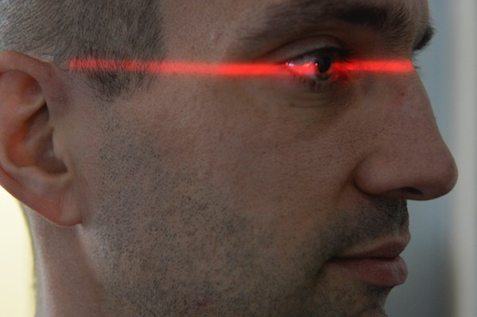
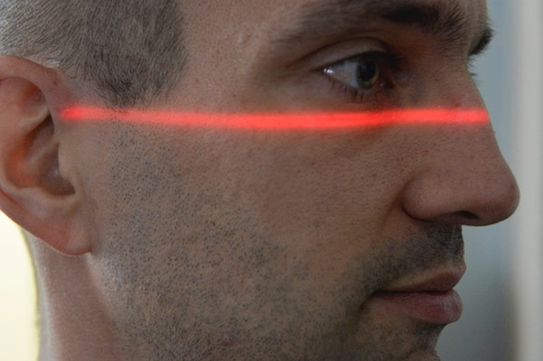
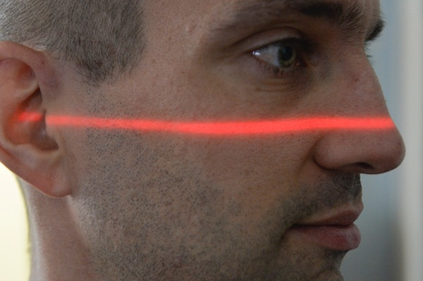
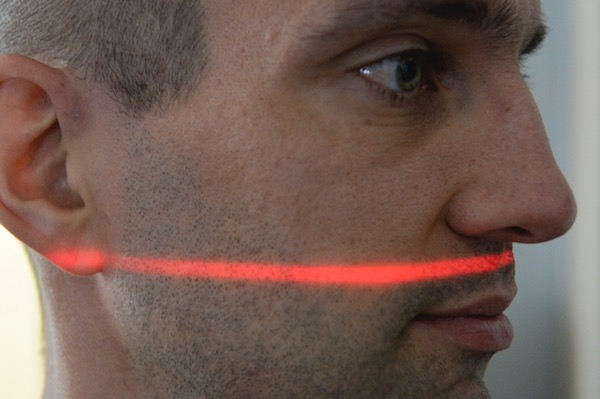

# Images

{width="30%"}

## {.small}

    {css-formatting}

    {width="30%"}

# Fullscreen Images

Fullscreen images are added to the slide header. Do not give the slide a title.

    # 

#  {.sub data-menu-title="Fullscreen Images Example"}

# Image Sequence

{.fragment .sequence width="500px"} {.fragment .sequence width="500px"} {.fragment .sequence width="500px"} {.fragment .sequence width="500px"}

# Image Sequence Syntax {.sub}

## {.small}

    {.fragment .sequence}
    {.fragment .sequence}
    {.fragment .sequence}
    {.fragment .sequence}

# Videos {.columns}

## {.left}

{.controls width="450px"}

{.controls .autoplay width="450px"}

## {.right}

{.controls start="1" width="450px"}

{.controls .autoplay .loop width="450px"}

# Video Syntax {.sub}

## {.x-small}

    {.controls}

    {.controls .autoplay}

    {.controls start="1"}

    {.controls .autoplay .loop}

# External Videos

{autoplay="1" width="85%" start="8"}

## {.small}

    {width="85%" start="8"}

# External Videos Syntax

    {css-formatting}

Replace `service` with `youtube`, `vimeo` or `twitch`.\
Replace `video-id` with the actual video id or twitch channel name, usually found in the URL:

## {.example}

**YouTube:** https://youtu.be/<u>qEcmwHRG2Mo</u>\
**Vimeo:** https://vimeo.com/<u>9698387</u>\
**Twitch:** https://www.twitch.tv/<u>ieeevr2020_great_room_1</u>

# YouTube Video

{autoplay="1"}

# Fullscreen Videos

Add fullscreen videos to the slide header. Do not include a slide title.

    # {.controls}

#  {.sub .controls data-menu-title="Fullscreen Videos Example"}

# Audio {.columns}

## {.left .example}

{.controls .loop}

## {.right .example}

{.controls .autoplay .muted}

## {.x-small .bottom}

    {.controls .loop}

    {.controls .autoplay .muted}

# External Websites & PDFs

Use the `{.iframe}` tag to embed external websites and PDF Documents.

## {.small}

    # {.iframe}

    # {.iframe}

# {datamenu-title="External Websites Example" .iframe .sub }

# {.iframe .sub data-menu-title="Embed PDFs Example"}

# Virtual Tables

$$
\begin{eqnarray*}
a &=& b \\
a^2 &=& ab \\
2a^2 &=& a^2 + ab \\
2a^2-2ab &=& a^2 - ab \\
2a(a-b) &=& a (a-b) \\
2a &=& a \\
2 &=& 1
\end{eqnarray*}
$$
