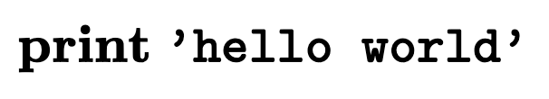
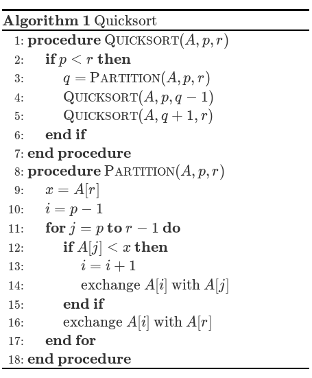

# Implementation of [Pseudocode.js](https://github.com/SaswatPadhi/pseudocode.js)

## YAML Options: 

 - **indent**: indent size inside a control block - must use 'em'
 - **delimiter**: value used to start and end a comment
 - **lineNumber**: if line numbering is enabled
 - **punctuation**: line number puncutation
 - **noEnd**: if block endings are shown
 - **caption**: reset the caption counter to this number

## Default Values {.x-small}

```{.yaml}
pseudocode:
  indent: 1.2em
  delimiter: '//'
  lineNumber: false
  punctuation: ':'
  noEnd: false
  caption: undefined
```

# {.columns}

## This code: {.left}

```{.pseudocode}
    \begin{algorithmic}
    \PRINT \texttt{'hello world'}
    \end{algorithmic}
``` 

## Should look like this: {.right}

{width=70%}

 

# {.columns}

## This code: {.left .x-small}

```{.pseudocode}
    \begin{algorithm}
    \caption{Quicksort}
    \begin{algorithmic}
    \PROCEDURE{Quicksort}{$A, p, r$}
        \IF{$p < r$} 
            \STATE $q = $ \CALL{Partition}{$A, p, r$}
            \STATE \CALL{Quicksort}{$A, p, q - 1$}
            \STATE \CALL{Quicksort}{$A, q + 1, r$}
        \ENDIF
    \ENDPROCEDURE
    \PROCEDURE{Partition}{$A, p, r$}
        \STATE $x = A[r]$
        \STATE $i = p - 1$
        \FOR{$j = p$ \TO $r - 1$}
            \IF{$A[j] < x$}
                \STATE $i = i + 1$
                \STATE exchange
                $A[i]$ with $A[j]$
            \ENDIF
            \STATE exchange $A[i]$ with $A[r]$
        \ENDFOR
    \ENDPROCEDURE
    \end{algorithmic}
    \end{algorithm}
```

## Should look like this: {.right}

{width=85%}


# Test Text-Style {.x-small}

```{.pseudocode}
    \begin{algorithm}
    \caption{Test text-style}
    \begin{algorithmic}
    \REQUIRE some preconditions
    \ENSURE some postconditions
    \INPUT some inputs
    \OUTPUT some outputs
    \PROCEDURE{Test-Declarations}{}
        \STATE font families: {\sffamily sffamily, \ttfamily ttfamily, \normalfont normalfont, \rmfamily rmfamily.}
        \STATE font weights: {normal weight, \bfseries bold, \mdseries
        medium, \lfseries lighter. }
        \STATE font shapes: {\itshape itshape \scshape Small-Caps \slshape slshape \upshape upshape.}
        \STATE font sizes: \tiny tiny \scriptsize scriptsize \footnotesize
        footnotesize \small small \normalsize normal \large large \Large Large
        \LARGE LARGE \huge huge \Huge Huge \normalsize
    \ENDPROCEDURE
    \PROCEDURE{Test-Commands}{}
        \STATE \textnormal{textnormal,} \textrm{textrm,} \textsf{textsf,} \texttt{texttt.}
        \STATE \textbf{textbf,} \textmd{textmd,} \textlf{textlf.}
        \STATE \textup{textup,} \textit{textit,} \textsc{textsc,} \textsl{textsl.}
        \STATE \uppercase{uppercase,} \lowercase{LOWERCASE.}
    \ENDPROCEDURE
    \PROCEDURE{Test-Colors}{}
    % feature not implemented
    \ENDPROCEDURE
    \end{algorithmic}
    \end{algorithm}
```

#  Test Atoms

```{.pseudocode}
    \begin{algorithm}
    \caption{Test atoms}
    \begin{algorithmic}
    \STATE \textbf{Specials:} \{ \} \$ \& \# \% \_
    \STATE \textbf{Bools:} \AND \OR \NOT \TRUE \FALSE
    \STATE \textbf{Carriage return:} first line \\ second line
    \STATE \textbf{Text-symbols:} \textbackslash
    \STATE \textbf{Quote-symbols:} `single quotes', ``double quotes''
    \STATE \textbf{Math:} $(\mathcal{C}_m)$, $i \gets i + 1$, $E=mc^2$, \( x^n + y^n = z^n \), $\$$, \(\$\)
    \END{ALGORITHMIC}
    \END{ALGORITHM}
```
